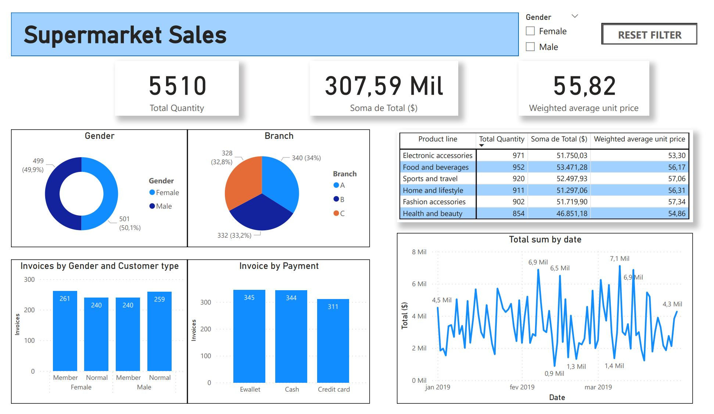
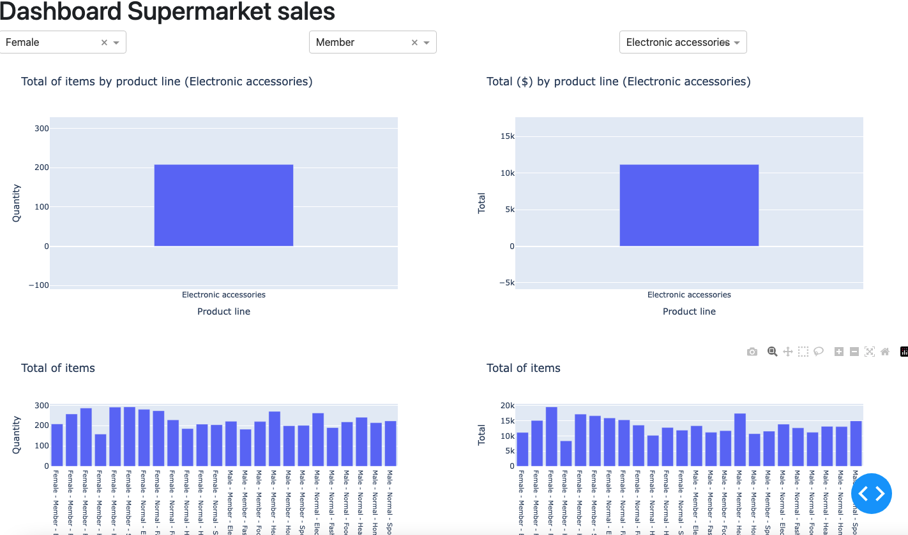

# Supermarket Sales Dashboard

Ainda em construção.

Objetivo: Contruir um dashboard utilizando python para análise de dados de um supermercado retirado da plataforma Kaggle (https://www.kaggle.com/datasets/aungpyaeap/supermarket-sales/data
import pandas as pd).

Primeiramente foi contruído um dashboard com Power BI. Com python e a biblioteca Dash, o intuito do código é gerar um dashboard igual ou parecido com esse:



# Sobre o projeto [PT-BR]

Nesse projeto foi utilizado Power BI e Python

# Tecnologias utilizadas

- Python
- Power BI

# Como executar o projeto

Pré-requisitos: Python

```bash
# clonar repositório
git clone https://github.com/AllanGomesCorrea/Supermarket_sales.git

# criar o virtual environment
python3 -m venv venv

# ativar a venv (Linux,macOS)
source venv/bin/activate

# ativar a venv (Windows)
venv\Scripts\activate

# executar o comando para instalação das versões
pip install -r ./requirements.txt

# executar o projeto
python main.py
python dashboard.py
```

# Resultado

Algumas análises prévias foram feitas utilizando a biblioteca Pandas e plotando alguns gráficos a parte. Uma pré visualização do dashboard pode ser acompanhada a seguir:



# Autor

[](https://www.linkedin.com/in/allancorrea/)

Allan Gomes Corrêa
